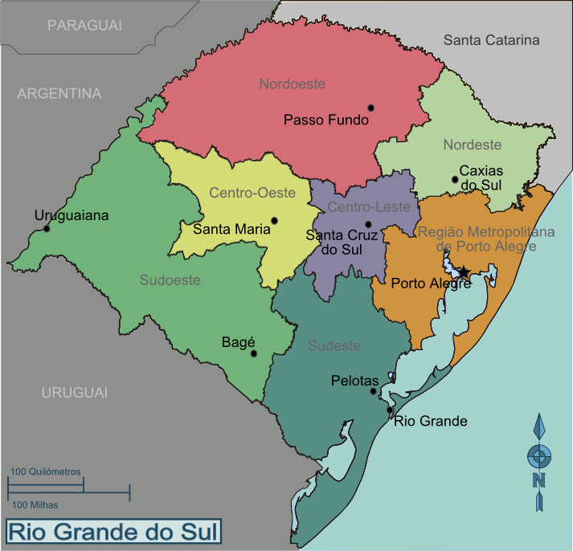

```{r setup, include=FALSE}
knitr::opts_chunk$set(echo = TRUE, message = FALSE, warning = FALSE)
```

# Apresentação

Esse trabalho visa apresentar o desempenho dos munícipios gaúchos nos blocos educação, renda e saúde no período de 2007 a 2014. Os dados são baseados no IDESE, um indicador-síntese desenvolvido pela Fundação de Economia e Estatística com o propósito de mensurar o nível de desenvolvimento socioeconômico dos municípios gaúchos, bem como fornecer informações para o planejamento de políticas públicas.

As regiões do Rio Grande do Sul a serem consideradas são as seguintes:



## Leitura e Limpeza

```{r}
library(dplyr)
library(magrittr)
library(lubridate)
library(ggplot2)
library(skimr)
library(tidyr)
library(highcharter)
library(devtools)
library(mapsBR)
library(sf)
library(leaflet)
library(DT)

#install_github(lgsilvaesilva/mapsBR')

library(rgeos)

idese <- readRDS('data/Idese Municipios 2007-2014.rds')
  
# Exibir o nome das colunas
colnames(idese)

# Remoção de caracteres especiais das colunas
names(idese) <- make.names(names(idese))

# Deixar as colunas em lowcase
names(idese) <- tolower(names(idese))

# Renomear algumas colunas
idese <- idese %>% 
  rename(
    bl_edu = bloco.educação,
    bl_edu_ef = bloco.educação.ensino.fundamental,           
    bl_edu_ef_af = bloco.educação.ensino.fundamental.anos.finais,
    bl_edu_ef_ai = bloco.educação.ensino.fundamental.anos.iniciais,
    bl_edu_em = bloco.educação.ensino.médio,
    bl_edu_ea = bloco.educação.escolaridade.adulta,
    bl_edu_pre = bloco.educação.pré.escola,
    bl_rd = bloco.renda,
    bl_rd_aprop = bloco.renda.apropriação.da.renda,
    bl_rd_ger = bloco.renda.geração.da.renda,
    bl_sd = bloco.saúde,
    bl_sd_cond_gerais = bloco.saúde.condições.gerais.de.saúde,
    bl_sd_obitos_evitaveis = bloco.saúde.condições.gerais.de.saúde.óbitos.por.causas.evitáveis,
    bl_sd_obitos_mal_definido = bloco.saúde.condições.gerais.de.saúde.óbitos.por.causas.mal.definidas,
    bl_sd_long = bloco.saúde.longevidade,
    bl_sd_materno_infantil = bloco.saúde.saúde.materno.infantil,                                  
    bl_sd_consult_pre_natal = bloco.saúde.saúde.materno.infantil.consultas.pré.natal,
    bl_sd_morte_menor_5anos = bloco.saúde.saúde.materno.infantil.mortalidade.de.menores.de.5.anos
  )

  # Sumário rápido do dataset
  idese %>% 
    skim()
```

# Hipótese 1: Correlação Entre os Blocos
Vamos verificar se há alguma correlação entre os blocos educação, renda e saúde.

```{r}

idese_corr <- idese %>% 
  mutate(Educacao = bl_edu, Renda = bl_rd, Saude = bl_sd) %>% 
  select(Educacao,Renda,Saude)

hchart(cor(idese_corr))
```

# Hipótese 2: Desempenho do IDESE no RS
Como foi o IDESE do RS ao longo dos anos?

```{r}
idese %>% 
    group_by(ano) %>% 
    summarise(media = mean(idese, na.rm = TRUE)) %>%
    ggplot(aes(x = ano, y = media)) +
    geom_line() +
    ylim(0,1) +
    ggtitle("Média IDESE no RS") + 
    xlab("Ano") + ylab("Média IDESE") +
    geom_text(aes(label=round(media,3)),hjust=0.5, vjust=2)
```

# Hipótese 3: Avanço no Desempenho do Ensino Fundamental
Será que houve um avanço no desempenho dos alunos do Ensino Fundamental no RS?

```{r}
idese %>% 
    group_by(ano) %>% 
    summarise(media = mean(bl_edu_ef, na.rm = TRUE)) %>%
    ggplot(aes(x = ano, y = media)) +
    geom_line() +
    ylim(0,1) +
    ggtitle("Média das Notas dos Alunos do Ensino Fundamental no RS") + 
    xlab("Ano") + ylab("Média de Notas") +
    geom_text(aes(label=round(media,3)),hjust=0.5, vjust=2)
```

# Hipótese 4: Melhor Desempenho na Prova Brasil do Ensino Fundamental
Qual o grupo do Ensino Fundamental que apresentou melhor desempenho na Prova Brasil no RS?

```{r}
idese %>% 
  group_by(ano) %>% 
  summarise(anos_iniciais = round(mean(bl_edu_ef_ai, na.rm = TRUE),3), anos_finais = round(mean(bl_edu_ef_af, na.rm = TRUE),3)) %>%
  gather(variable, value, c("anos_iniciais", "anos_finais")) %>%
  filter(variable %in% c("anos_iniciais", "anos_finais")) %>%
  mutate(value01 = scale(value)) %>% 
  hchart("line", hcaes(x = ano, y = value, group = variable)) %>% 
  hc_title(text = "Comparação da Média das Notas entre Alunos do Ensino Fundamental do RS") %>% 
  hc_xAxis(title = list(text = "Anos")) %>% 
  hc_yAxis(title = list(text = "Média das Notas")) %>% 
  hc_yAxis(max = 1)
```

# Hipótese 5: Avanço nas Matrículas no Ensino Médio
Será que houve um aumento na taxa de matrícula de alunos no Ensino Médio no RS?

```{r}
idese %>% 
    group_by(ano) %>% 
    summarise(media = mean(bl_edu_em, na.rm = TRUE)) %>%
    ggplot(aes(x = ano, y = media)) +
    geom_line() +
    ylim(0,1) +
    ggtitle("Taxa de Alunos Matriculados no Ensino Médio no RS") + 
    xlab("Ano") + ylab("Taxa de Matrículas (%)") +
    geom_text(aes(label=round(media,2)*100),hjust=0.5, vjust=2)
```

# Hipótese 6: TOP 10 Cidades - Ensino Fundamental
Quais são as 10 cidades gaúchas que possuíram o melhor desempenho no Ensino Fundamental?

```{r}
idese %>%
  group_by(nome) %>% 
  summarise(media = round(mean(bl_edu_ef, na.rm = TRUE),3)) %>%
  arrange(desc(media)) %>%
  slice(1:10) %>% 
  hchart(type = "treemap",
         hcaes(x = nome, value = media, color = media))
```

# Hipótese 7: Distribuição IDESE no RS
Como está distribuído o IDESE no RS?

```{r}
data(regMun) #carrega mapa com os municípios brasileiros

regMun %<>% 
  st_as_sf() %>% 
  filter(UF == 'RS') %>% 
  mutate(NOME = iconv(NOME, from = "UTF-8", to = "latin1"))

idese_mapa <- idese %>%
  group_by(cod) %>%
  summarise(media = round(mean(idese, na.rm = TRUE)*100,3)) %>% 
  mutate(cod = as.numeric(as.character(cod)))

xx <- regMun %>% 
  left_join(
  y = idese_mapa,
  by = c("COD" = "cod")
)

tooltip <- sprintf("<strong>%s</strong><br>
                   <br>Taxa: %s<br>",
                   xx$NOME,
                   xx$media)


# definindo a paleta de cores
npal <- colorBin("Blues", xx$media)

mapa1 <- leaflet(xx) %>%
  addProviderTiles(providers$CartoDB.Positron) %>%
  addPolygons(fillOpacity = 0,
              weight      = 0.85,
              color       = "#000000") %>%
   addPolygons(color      = ~npal(media),
              stroke      = F,
              weight      = 0.1,
              fillOpacity = 0.7,
              popup       = tooltip) %>%
    addLegend("bottomright",
              pal = npal,
              values = ~media,
              title = "IDESE")

mapa1
```

# Hipótese 8: Taxa de Adultos com Ensino Médio
Quais são as regiões do RS que possuíram as maiores e menores taxas de adultos com Ensino Médio concluído?

```{r}
idese_mapa <- idese %>%
  group_by(cod) %>%
  summarise(media = round(mean(bl_edu_ea, na.rm = TRUE)*100,3)) %>% 
  mutate(cod = as.numeric(as.character(cod)))

xx <- regMun %>% 
  left_join(
  y = idese_mapa,
  by = c("COD" = "cod")
)

tooltip <- sprintf("<strong>%s</strong><br>
                   <br>Taxa: %s<br>",
                   xx$NOME,
                   xx$media)


# definindo a paleta de cores
npal <- colorBin("Blues", xx$media)

mapa1 <- leaflet(xx) %>%
  addProviderTiles(providers$CartoDB.Positron) %>%
  addPolygons(fillOpacity = 0,
              weight      = 0.85,
              color       = "#000000") %>%
   addPolygons(color      = ~npal(media),
              stroke      = F,
              weight      = 0.1,
              fillOpacity = 0.7,
              popup       = tooltip) %>%
    addLegend("bottomright",
              pal = npal,
              values = ~media,
              title = "Taxa Adultos no EM (%)")

mapa1
```

# Hipótese 9: Distribuição de Renda
Como está distribuída a geração de renda no RS?

```{r}

#install_github(lgsilvaesilva/mapsBR')

idese_mapa <- idese %>%
  group_by(cod) %>%
  summarise(media = round(mean(bl_rd, na.rm = TRUE)*100,3)) %>% 
  mutate(cod = as.numeric(as.character(cod)))

xx <- regMun %>% 
  left_join(
  y = idese_mapa,
  by = c("COD" = "cod")
)

tooltip <- sprintf("<strong>%s</strong><br>
                   <br>Taxa: %s<br>",
                   xx$NOME,
                   xx$media)


# definindo a paleta de cores
npal <- colorBin("Blues", xx$media)

mapa1 <- leaflet(xx) %>%
  addProviderTiles(providers$CartoDB.Positron) %>%
  addPolygons(fillOpacity = 0,
              weight      = 0.85,
              color       = "#000000") %>%
   addPolygons(color      = ~npal(media),
              stroke      = F,
              weight      = 0.1,
              fillOpacity = 0.7,
              popup       = tooltip) %>%
    addLegend("bottomright",
              pal = npal,
              values = ~media,
              title = "Taxa Geração Renda")

mapa1
```

# Hipótese 10: Índice de Longevidade
Quais são as regiões que apresentaram maior índice de longevidade?

```{r}

#install_github(lgsilvaesilva/mapsBR')

idese_mapa <- idese %>%
  group_by(cod) %>%
  summarise(media = round(mean(bl_sd_long, na.rm = TRUE)*100,3)) %>% 
  mutate(cod = as.numeric(as.character(cod)))

xx <- regMun %>% 
  left_join(
  y = idese_mapa,
  by = c("COD" = "cod")
)

tooltip <- sprintf("<strong>%s</strong><br>
                   <br>Índice de Longevidade: %s<br>",
                   xx$NOME,
                   xx$media)


# definindo a paleta de cores
npal <- colorBin("Blues", xx$media)

mapa1 <- leaflet(xx) %>%
  addProviderTiles(providers$CartoDB.Positron) %>%
  addPolygons(fillOpacity = 0,
              weight      = 0.85,
              color       = "#000000") %>%
   addPolygons(color      = ~npal(media),
              stroke      = F,
              weight      = 0.1,
              fillOpacity = 0.7,
              popup       = tooltip) %>%
    addLegend("bottomright",
              pal = npal,
              values = ~media,
              title = "Taxa Longetividade")

mapa1
```

# Hipótese 11: Desempenho do Índice de Longevidade
Será que houve um avanço no índice de longevidade no RS?

```{r}
idese %>% 
    group_by(ano) %>% 
    summarise(media = mean(bl_sd_long, na.rm = TRUE)) %>%
    ggplot(aes(x = ano, y = media)) +
    geom_line() +
    ylim(0,1) +
    ggtitle("Taxa de Longevidade no RS") + 
    xlab("Ano") + ylab("Taxa de Longevidade") +
    geom_text(aes(label=round(media,3)),hjust=0.5, vjust=2)
```

# Considerações Finais


  + A base de dados é composta por 3976 municípios.
  + Há uma relação entre a Renda dos municípios com o índice de Educação.
  + De um modo geral, o RS apresentou um aumento de 0.07% no IDESE de 2007 (0.671) a 2014 (0.745).
  + As regiões Metropolitana, Nordeste e Nordoeste se destacam por apresentarem os maiores índices de desenvolvimento (IDESE).
  + Houve um aumento no desempenho dos alunos do Ensino Fundamental no RS durante o período de 2007 a 2014. O grupo que apresentou melhor desempenho na Prova Brasil foram os alunos dos anos iniciais (1º ao 5º ano).
  + Houve um declínio na taxa de matriculados no Ensino Médio no RS. O último ano do período pesquisado (2014) foi de 78% matriculados, uma redução de 4% em comparação com o início do período (2007) com 82%. Durante esse período, o ano de 2011 foi o que apresentou o pior indicativo, com 73% matriculados no Ensino Médio.
  + As regiões que apresentaram melhor índice de adultos matriculados no Ensino Médico (em concentração de municípios) foram Região Metropolitana, Nordeste, Nordoeste e Sudoeste.
  + As regiões que apresentaram maior geração de renda (em concentração de municípios) foram Região Metropolitana, Nordeste e Nordoeste.
  + O RS possui um alto índice de longevidade, com média de 0.83, apresentando um aumento de 0.02% em 2014 em comparação com 2007. Os blocos de Renda e Educação apresentaram média de 0.65 e 0.62 respectivamente no período pesquisado.

Fonte das Regiões: https://pt.wikivoyage.org/wiki/Rio_Grande_do_Sul